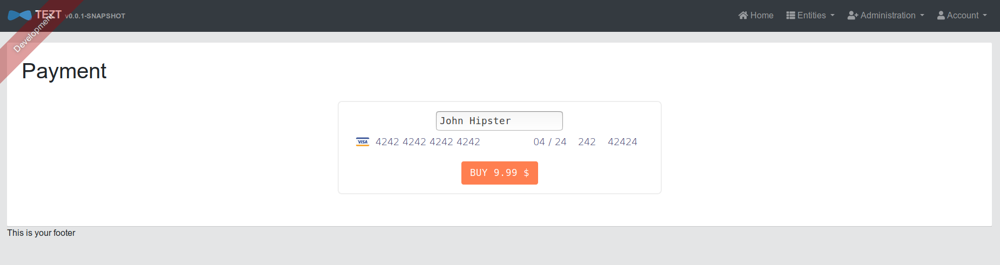
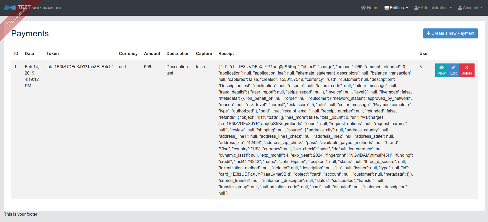
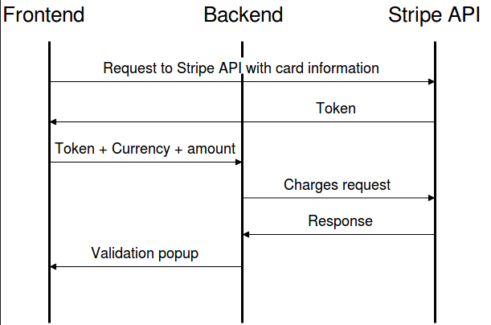

# generator-jhipster-stripe-payment
[![NPM version][npm-image]][npm-url] [![Build Status][travis-image]][travis-url] [![Dependency Status][daviddm-image]][daviddm-url]
> JHipster module, this module integrate the payment plateform STRIPE to a Jhipster project.(It includes a web payment page and a JHipster payment entity)

# Introduction

This is a [JHipster](http://jhipster.github.io/) module, that is meant to be used in a JHipster application. This will add a new payment page (located in yourURL/payments for examples if you are still developping: localhost:8080/payments):


When a payment is successful, a popup will appear and a new payment entity will be created:


Just click once on buy!

Please note that the 'receipt' field corresponds to the json file returned by the stripe api. It includes the receipt 'url'.

You can find a sample application using this generator here : [Sample Application](https://github.com/contribution-jhipster-uga/sample-application-stripe)


# Prerequisites

As this is a [JHipster](http://jhipster.github.io/) module, we expect you have JHipster and its related tools already installed:

- [Installing JHipster](https://jhipster.github.io/installation.html)

You will also need a Stripe account:

- [Sign up, Stripe](https://dashboard.stripe.com/register)

For the generation, you will need to know your publishable and private Stripe key.

- Your application must works with maven and angularX. (For the moment, this generator doesn't support gradle or react).


# Installation

## With Yarn

To install this module:

```bash
yarn global add generator-jhipster-stripe-payment
```

To update this module:

```bash
yarn global upgrade generator-jhipster-stripe-payment
```

## With NPM

To install this module:

```bash
npm install -g generator-jhipster-stripe-payment
```

To update this module:

```bash
npm update -g generator-jhipster-stripe-payment
```

# Usage

Now you need to start the JHipster generation using the following command:
```bash
yo jhipster-stripe-payment
```
If rewriting is necessary, please enter 'a' to rewrite all files.

Then start your application:
```bash
./mvnw
```

# Additional information
Here is the dynamic view of the operation between the front end, back end and stripe api.


# License


MIT © [Contribution JHipster UGA](https://github.com/contribution-jhipster-uga/)
Julien COURTIAL, Hugo GROS-DAILLON, Cédric LAFRASSE et Bastien TERRIER

Permission is hereby granted, free of charge, to any person obtaining a copy of this software and associated documentation files (the "Software"), to deal in the Software without restriction, including without limitation the rights to use, copy, modify, merge, publish, distribute, sublicense, and/or sell copies of the Software, and to permit persons to whom the Software is furnished to do so, subject to the following conditions:

The above copyright notice and this permission notice shall be included in all copies or substantial portions of the Software.

THE SOFTWARE IS PROVIDED "AS IS", WITHOUT WARRANTY OF ANY KIND, EXPRESS OR IMPLIED, INCLUDING BUT NOT LIMITED TO THE WARRANTIES OF MERCHANTABILITY, FITNESS FOR A PARTICULAR PURPOSE AND NONINFRINGEMENT. IN NO EVENT SHALL THE AUTHORS OR COPYRIGHT HOLDERS BE LIABLE FOR ANY CLAIM, DAMAGES OR OTHER LIABILITY, WHETHER IN AN ACTION OF CONTRACT, TORT OR OTHERWISE, ARISING FROM, OUT OF OR IN CONNECTION WITH THE SOFTWARE OR THE USE OR OTHER DEALINGS IN THE SOFTWARE.

[npm-image]: https://img.shields.io/npm/v/generator-jhipster-database-backup.svg
[npm-url]: https://npmjs.org/package/generator-jhipster-database-backup
[travis-image]: https://travis-ci.org/contribution-jhipster-uga/generator-jhipster-database-backup.svg?branch=master
[travis-url]: https://travis-ci.org/contribution-jhipster-uga/generator-jhipster-database-backup
[daviddm-image]: https://david-dm.org/contribution-jhipster-uga/generator-jhipster-database-backup.svg?theme=shields.io
[daviddm-url]: https://david-dm.org/contribution-jhipster-uga/generator-jhipster-database-backup
